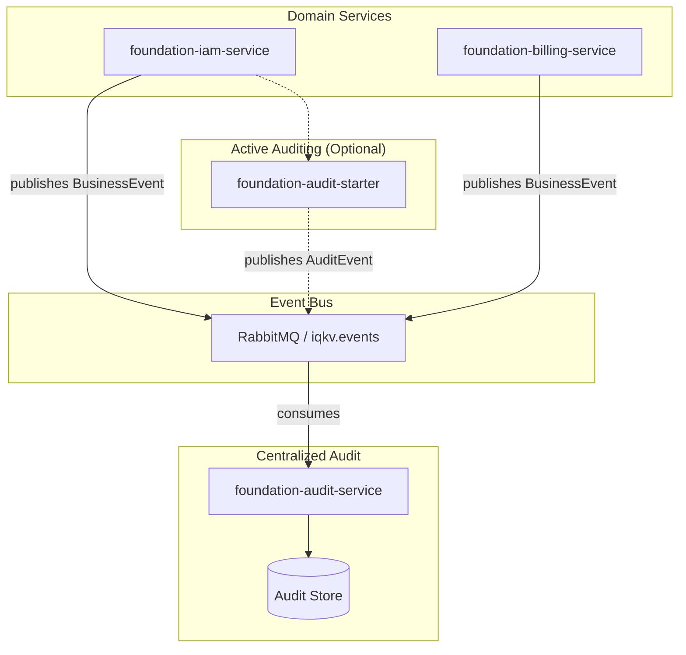

# Proposal: Extensible Audit Model (Provider-Friendly Design)

## Overview

This document proposes the design for a flexible, extensible audit logging system for the IQKV platform.

The key principle is **"No Vendor Lock-in"** — consistent with the overall philosophy of the platform (inspired by Magento/Oro flexibility). The audit system should allow different implementations while providing a solid default.

## Goals

- Enable services (`foundation-iam-service`, `foundation-billing-service`, future services) to log activities consistently.
- Support multiple audit backends (default DB, Elasticsearch, DataDog, custom SIEM, etc.).
- Make it easy for users to plug in their own audit provider.
- Keep the core services decoupled from storage details.
- Support both simple and enterprise-grade compliance requirements.

## Proposed Architecture

### 1. New Repositories & Modules

- **`foundation-audit-spi`** — Service Provider Interface (contracts)
- **`foundation-audit-model`** — Shared neutral data models, events, and enums
- **`foundation-audit-starter`** — Spring Boot Starter for active auditing (optional)
- **`foundation-audit-service`** — Centralized microservice for event consumption and storage

### 2. High-Level Design



### 3. The "Service-Centric" Approach (Recommended)

Creating a dedicated `foundation-audit-service` to "grab" RabbitMQ events is the most lightweight and non-intrusive way to implement auditing across the platform.

#### How it works:

1. **Passive Observation**: The `foundation-audit-service` acts as a platform-wide observer. It binds its own queues to the existing `iqkv.events` exchange.
2. **Event Transformation**: When it receives a `UserEvent` or `InvoiceEvent`, it maps the domain-specific data into a generic `AuditRecord`.
3. **Storage Isolation**: The audit service maintains its own database (PostgreSQL by default, potentially Elasticsearch later), ensuring that audit logs never compete for resources with business transactions.

#### Comparison: Starter vs. Service

| Feature           | Audit Starter (AOP)                  | Audit Service (Event-Driven)             |
| :---------------- | :----------------------------------- | :--------------------------------------- |
| **Intrusiveness** | Low (requires annotation/dependency) | **Zero** (no changes to domain services) |
| **Visibility**    | Captures internal method calls       | Captures public business events          |
| **Context**       | Full technical context (IP, Agent)   | Limited to what's in the event payload   |
| **Complexity**    | Distributed across services          | Centralized in one service               |

### 4. Hybrid Strategy

To achieve a complete audit trail, we will use a hybrid approach:

1. **Primary (Audit Service)**: Consumes existing business events for 80% of audit needs (signups, payments, settings changes).
2. **Secondary (Audit Starter)**: Used only for high-sensitivity actions that don't trigger business events (e.g., "Admin viewed customer credit card last 4 digits" or "Exported user list").

### 4. Enriched Audit Event Model

The `AuditEvent` in `foundation-audit-model` should follow a structured format:

```java
public record AuditEvent(
    UUID id,
    String action,          // e.g., USER_LOGIN, INVOICE_PAID
    String entityType,      // e.g., USER, TENANT, INVOICE
    String entityId,
    Actor actor,            // userId, email, ipAddress, userAgent
    String tenantKey,
    ActivitySeverity severity, // INFO, WARN, CRITICAL
    Map<String, Object> details, // Flexible payload
    Instant occurredAt,
    String traceId
) {}
```

### 5. Messaging Pipeline (RabbitMQ)

- **Exchange**: `iqkv.audit.events` (Topic)
- **Routing Key**: `audit.[service-name].[action]`
- **Reliability**: Use the Outbox Pattern in microservices to ensure `AuditEvent` is published even if RabbitMQ is temporarily down.

### 6. Package Structure

#### `foundation-audit-spi`

- `com.iqkv.foundation.audit.spi`
  - `AuditStore.java` (Interface for persistence)
  - `AuditLogService.java` (High-level API)
  - `AuditProvider.java`

#### `foundation-audit-model`

- `com.iqkv.foundation.audit.model`
  - `event/AuditEvent.java`
  - `record/AuditRecord.java`
  - `enum/Action.java`, `enum/Severity.java`

#### `foundation-audit-service`

- `com.iqkv.foundation.audit.service`
  - `consumer/BusinessEventConsumer.java` (Consumes IAM/Billing events)
  - `api/AuditSearchController.java` (For Admin UI)
  - `repository/AuditRecordRepository.java`

### 7. Configuration

```yaml
iqkv:
  audit:
    service:
      enabled: true
      storage-type: postgres # postgres | elasticsearch
    starter:
      enabled: false # Only enable if AOP auditing is needed
```

### Benefits

- **Zero-Touch for Core Logic**: No code changes needed in IAM or Billing for basic auditing.
- **Decoupled**: Services don't care how or where audit logs are stored.
- **Scalable**: Audit processing doesn't steal CPU/Memory from checkout or login flows.
- **Compliance Ready**: Centralized place to implement GDPR "right to be forgotten" or retention policies.

### Implementation Roadmap

**Phase 1 (v0.3)**

- Define `foundation-audit-model` (Neutral event structures).
- Create `foundation-audit-service` (The central consumer).
- Implement IAM event listeners in Audit Service (Logins, Signup).
- Basic PostgreSQL storage.

**Phase 2**

- Implement Billing event listeners in Audit Service (Payments, Subscriptions).
- Create `foundation-audit-starter` for `@Auditable` support (Active Auditing).
- Add "Audit Log" tab to Platform Admin UI.

**Phase 3**

- Advanced search/filtering API.
- Elasticsearch provider for high-volume logs.
- Automated retention and archiving.

---

### Very basic, high-level example

```
com.iqkv.foundation.audit

├── spi/                          # Service Provider Interface (Core Contract)
│   ├── AuditLogService.java             # Main interface
│   ├── AuditEventPublisher.java
│   ├── ActivityLogRepository.java
│   └── AuditProvider.java               # Marker / Config interface
│
├── model/                        # Shared Data Models (Neutral)
│   ├── event/
│   │   ├── UserActivityEvent.java
│   │   ├── AuditEvent.java
│   │   └── ...
│   ├── record/
│   │   ├── UserActivityLog.java
│   │   ├── Actor.java
│   │   └── ActivityContext.java
│   └── enum/
│       ├── ActivityAction.java
│       ├── EntityType.java
│       └── ActivitySeverity.java
│
├── provider/                     # Default Implementation
│   ├── internal/
│   │   ├── DefaultAuditLogService.java
│   │   └── InMemoryAuditRepository.java   #
│   └── config/
│       └── DefaultAuditAutoConfiguration.java
│
└── dto/                          # API transfer objects
```

---

**Status**: Proposal  
**Author**: [Your Name]  
**Date**: May 22, 2026  
**Version**: 1.0
