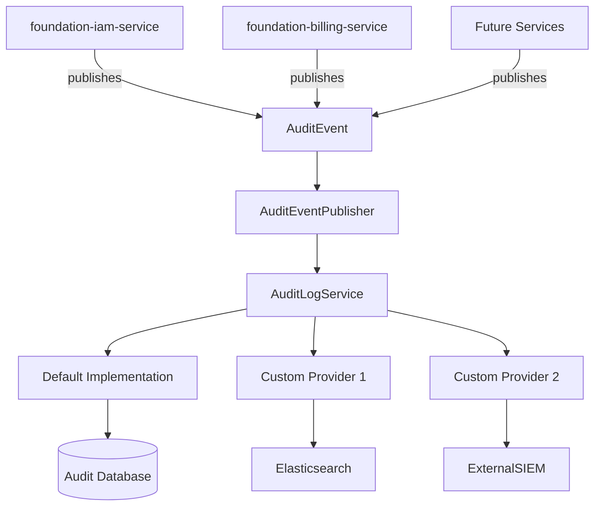

# Proposal: Extensible Audit Model (Provider-Friendly Design)

## Overview

This document proposes the design for a flexible, extensible audit logging system for the IQKV platform. 

The key principle is **"No Vendor Lock-in"** — consistent with the overall philosophy of the platform (inspired by Magento/Oro flexibility). The audit system should allow different implementations while providing a solid default.

## Goals

- Enable services (`foundation-iam-service`, `foundation-billing-service`, future services) to log activities consistently.
- Support multiple audit backends (default DB, Elasticsearch, DataDog, custom SIEM, etc.).
- Make it easy for users to plug in their own audit provider.
- Keep the core services decoupled from storage details.
- Support both simple and enterprise-grade compliance requirements.

## Proposed Architecture

### 1. Two New Repositories

- **`foundation-audit-spi`** — Service Provider Interface (contracts)
- **`foundation-audit-model`** — Shared neutral data models, events, and enums

### 2. High-Level Design



### 3. Package Structure

#### `foundation-audit-spi`

- `com.iqkv.foundation.audit.spi`
  - `AuditLogService.java` (main interface)
  - `AuditEventPublisher.java`
  - `AuditProvider.java` (marker)
  - `ActivityLogRepository.java` (optional)

#### `foundation-audit-model`

- `com.iqkv.foundation.audit.model`
  - `event/` — Domain events
  - `record/` — Persistent log entries
  - `enum/` — ActivityAction, EntityType, etc.
  - `actor/`, `context/`, `dto/`

### 4. Core Interfaces

**AuditLogService** (in SPI)
```java
public interface AuditLogService {
    void log(AuditEvent event);
    void log(String action, String entityType, String entityId, Object details);
    
    Page<ActivityLogEntry> search(ActivityLogFilter filter);
    void purgeOldLogs(Duration olderThan);
}
```

**AuditEventPublisher** (used by IAM, Billing, etc.)
```java
public interface AuditEventPublisher {
    void publish(AuditEvent event);
}
```

### 5. Configuration

```yaml
iqkv:
  audit:
    enabled: true
    provider: default          # default | elasticsearch | custom | none
    retention-days: 365
```

### Benefits

- **Flexibility**: Users can replace the audit backend without changing business logic.
- **Consistency**: All services use the same event vocabulary.
- **Extensibility**: Easy to add new providers.
- **Performance**: Async event publishing (RabbitMQ).
- **Future-proof**: Ready for compliance (GDPR, SOC2, etc.).

### Implementation Roadmap

**Phase 1 (v0.3)**
- Create `foundation-audit-spi` and `foundation-audit-model` external libs
- Implement default provider (MyBatis + PostgreSQL)
- Integrate into IAM service (key actions)
- Integrate into Billing service (key actions)

**Phase 2**
- Add RabbitMQ event consumption
- Implement Activity Log tab in Platform Admin UI
- Add more providers (example: Elasticsearch)

**Phase 3**
- Advanced features (export, retention policies, alerts)

---

### Very basic, high-level example

```
com.iqkv.foundation.audit

├── spi/                          # Service Provider Interface (Core Contract)
│   ├── AuditLogService.java             # Main interface
│   ├── AuditEventPublisher.java
│   ├── ActivityLogRepository.java
│   └── AuditProvider.java               # Marker / Config interface
│
├── model/                        # Shared Data Models (Neutral)
│   ├── event/
│   │   ├── UserActivityEvent.java
│   │   ├── AuditEvent.java
│   │   └── ...
│   ├── record/
│   │   ├── UserActivityLog.java
│   │   ├── Actor.java
│   │   └── ActivityContext.java
│   └── enum/
│       ├── ActivityAction.java
│       ├── EntityType.java
│       └── ActivitySeverity.java
│
├── provider/                     # Default Implementation
│   ├── internal/
│   │   ├── DefaultAuditLogService.java
│   │   └── InMemoryAuditRepository.java   # 
│   └── config/
│       └── DefaultAuditAutoConfiguration.java
│
└── dto/                          # API transfer objects
```
---
**Status**: Proposal  
**Author**: [Your Name]  
**Date**: May 22, 2026  
**Version**: 1.0

