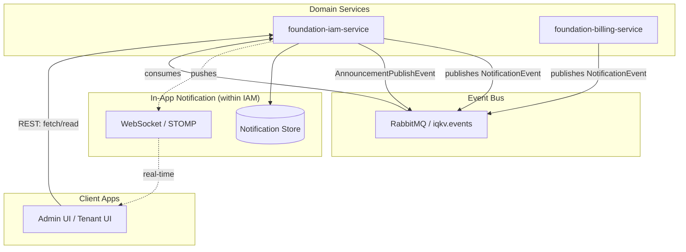

# In-App Notification Center (Real-time & Multi-lingual)

## Overview

This document describes the design and implementation of the In-App Notification Center for the IQKV platform. It provides users with real-time updates and a persistent history of system events and multi-lingual announcements directly within the Admin and Tenant UIs.

The notification logic is integrated into the `foundation-iam-service`, leveraging existing messaging infrastructure with added persistence, real-time delivery via WebSockets (STOMP), and full internationalization (i18n) support.

## Goals

- **Notification Bell**: A consistent UI element in the top-right corner of Admin and Tenant UIs.
- **Persistent Storage**: Notifications stored in a `user_notifications` table within the IAM database.
- **Real-time Delivery**: Instant updates via WebSockets (STOMP) proxied through the API Gateway.
- **Internationalization (i18n)**:
  - User-specific `locale` property stored as a BCP 47 tag (e.g. `en-US`).
  - System events translated via `MessageSource` at persistence time.
  - Multi-lingual site-wide announcements with `en-US` mandatory fallback.
- **Platform Admin Announcements**: Endpoints for admins to draft and broadcast messages in multiple languages.

## Architecture

### Components

- **`foundation-iam-service`**: Owns all notification logic — user locale management, persistent notification storage, WebSocket broker (STOMP), and multi-lingual announcement fan-out.
- **`foundation-gateway-service`**: Proxies WebSocket traffic to IAM via the existing `iam-api` catch-all route (`/api/v1/iam/**`). No dedicated WebSocket route is required.
- **`foundation-notification-model`**: Shared DTOs and events enriched with `targetUserId` and `locale`.

### High-Level Design



## Data Model

### User Locale

The `users` table has a `locale` column (`VARCHAR(20)`, default `en-US`) storing BCP 47 language tags. This is the source of truth for per-user language preference and is used by both the notification consumer and the fan-out process.

### Global Locales

A `locales` table manages the set of supported locales platform-wide. It drives the announcement creation form and the user profile language switcher.

```sql
CREATE TABLE locales (
    code        VARCHAR(20) PRIMARY KEY,          -- BCP 47 tag (e.g. 'en-US', 'ru-RU', 'it-IT')
    name        VARCHAR(50) NOT NULL,             -- Display name (e.g. 'English (US)')
    native_name VARCHAR(50),                      -- Native script name (e.g. 'Русский', 'Italiano')
    is_active   BOOLEAN DEFAULT TRUE,
    is_default  BOOLEAN DEFAULT FALSE,
    created_at  TIMESTAMP WITH TIME ZONE DEFAULT CURRENT_TIMESTAMP
);
```

**API**: `GET /api/v1/iam/locales` — public, returns all active locales ordered by default first, then name.

### Notification Persistence

The `user_notifications` table stores the final, already-localized message for each user. Locale is captured at creation time so the record is self-contained regardless of future user preference changes.

```sql
CREATE TABLE user_notifications (
    id             UUID PRIMARY KEY,
    target_user_id UUID NOT NULL,
    locale         VARCHAR(20) NOT NULL,   -- BCP 47 tag captured at creation time
    type           VARCHAR(50) NOT NULL,
    severity       VARCHAR(20),
    title          VARCHAR(255) NOT NULL,  -- Localized title
    message        TEXT,                  -- Localized message
    payload        JSONB,                 -- Deep-linking metadata
    is_read        BOOLEAN DEFAULT FALSE,
    created_at     TIMESTAMP WITH TIME ZONE DEFAULT CURRENT_TIMESTAMP,
    read_at        TIMESTAMP WITH TIME ZONE
);
```

The `payload` JSONB field carries flexible metadata for UI deep-linking and rendering hints:

- Entity reference: `{"invoiceId": "INV-123"}`
- Navigation: `{"targetRoute": "/billing/invoices/INV-123"}`
- UI hints: `{"icon": "IconReceipt", "color": "blue"}`

### Site-wide Announcements

Two tables manage multi-lingual announcements. Once an announcement reaches `PUBLISHED` status it is immutable — any change requires creating a new announcement.

```sql
CREATE TABLE site_announcement (
    id         UUID PRIMARY KEY,
    type       VARCHAR(50),
    status     VARCHAR(20) DEFAULT 'DRAFT',
    -- Status lifecycle: DRAFT → PENDING → PUBLISHING → PUBLISHED
    --                                               ↘ FAILED
    created_at TIMESTAMP WITH TIME ZONE DEFAULT CURRENT_TIMESTAMP
);

CREATE TABLE site_announcement_translations (
    announcement_id UUID REFERENCES site_announcement(id),
    locale          VARCHAR(20) NOT NULL,  -- BCP 47 tag
    title           VARCHAR(255) NOT NULL,
    message         TEXT NOT NULL,
    PRIMARY KEY (announcement_id, locale)
);
```

**Translation rules**:

- `en-US` is mandatory and serves as the global fallback. The API rejects requests without an `en-US` translation.
- All other locales are optional. Missing translations are not stored.
- During fan-out, if a user's locale has no translation, the `en-US` version is used automatically.

## Integration Flows

### System Event Flow (Email + In-App)

Handles automated events from domain services (e.g. `PASSWORD_CHANGED`, `INVOICE_PAID`).

1. A domain service publishes a `NotificationEvent` to the `iqkv.events` exchange with routing key `notification.iam.email`.
2. `NotificationConsumer` receives the event from the `iqkv.iam.notifications` queue.
3. `EmailService` sends a localized email to the recipient.
4. **Locale resolution** (in priority order):
   - `locale` field on the `NotificationEvent` if present.
   - User's `locale` from the `users` table, looked up by `targetUserId` or `recipientEmail`.
   - System default `en-US` as final fallback.
5. `MessageSource` translates the event type into a localized title and message using keys:
   - `notification.{TYPE}.title`
   - `notification.{TYPE}.message`
6. The localized `UserNotification` is persisted to `user_notifications`.
7. A WebSocket message is pushed to the user's personal destination: `/user/queue/notifications`.

Errors are caught and logged without re-throwing — failed messages route to the DLQ (`iqkv.dlq`) via the dead-letter exchange.

### Site-wide Announcement Flow (Streaming Fan-out)

Handles manual broadcasts created by Platform Admins.

1. **Drafting**: Admin creates an announcement via `POST /api/v1/iam/admin/announcements` with translations for one or more locales. `en-US` is required.
2. **Publish trigger**: Admin calls `POST /api/v1/iam/admin/announcements/{id}/publish`. The service validates the announcement is in `DRAFT` status, transitions it to `PENDING`, and publishes an `AnnouncementPublishEvent` to RabbitMQ with routing key `announcement.publish`.
3. **Guard check**: `AnnouncementConsumer` receives the event and verifies the announcement is still `PENDING`. If not (e.g. redelivery after a prior attempt), the message is silently discarded.
4. **Transition to `PUBLISHING`**: Status is updated via `FanOutService.updateStatus()` using `REQUIRES_NEW` propagation, committing independently of the listener transaction.
5. **Streaming cursor**: `UserMapper.findAllStreaming()` opens a MyBatis `Cursor<User>` with `fetchSize=1000` and `WHERE status = 'ACTIVE'`. This streams only active users from PostgreSQL without loading the full result set into memory.
6. **Batch processing**: Users are accumulated in batches of 1,000. For each user, the appropriate translation is selected by matching `user.locale` against the announcement's translation map, falling back to `en-US`. Each batch is persisted via `FanOutService.saveBatch()` (`REQUIRES_NEW`), so each batch commit is independent — a mid-fan-out crash does not roll back already-persisted batches.
7. **Completion**: After the cursor is fully consumed, a single `AnnouncementBroadcastResponse` is pushed to `/topic/announcements` via WebSocket, then the announcement status is set to `PUBLISHED`.
8. **Failure handling**: Any exception during steps 5–7 sets the status to `FAILED` and re-throws, routing the message to the DLQ. The `PENDING` guard in step 3 prevents redelivery from re-running the fan-out.

### Notification Lifecycle (REST API)

| Operation                       | Endpoint                                                             | Auth          |
| ------------------------------- | -------------------------------------------------------------------- | ------------- |
| Fetch notifications (paginated) | `GET /api/v1/iam/users/notifications?limit=10&offset=0&isRead=false` | Authenticated |
| Mark one as read                | `PUT /api/v1/iam/users/notifications/{id}/read`                      | Authenticated |
| Mark all as read                | `PUT /api/v1/iam/users/notifications/read-all`                       | Authenticated |
| Fetch active announcements      | `GET /api/v1/iam/announcements?locale=en-US`                         | Public        |

The `GET /api/v1/iam/users/notifications` response includes `totalElements`, `unreadCount`, and a paginated `items` list. The `isRead` query parameter is optional — omitting it returns all notifications.

The `GET /api/v1/iam/announcements` endpoint returns only `PUBLISHED` announcements for the requested locale. It is public and unauthenticated, intended for the notification bell's initial load.

**Polling vs Push**: The UI uses TanStack Query for polling and cache management. WebSocket pushes trigger cache invalidation for immediate updates without replacing the polling strategy.

## Background Processing Detail

### Transaction Isolation

`FanOutService` uses `Propagation.REQUIRES_NEW` on both `updateStatus()` and `saveBatch()`. This ensures:

- Status transitions (`PENDING → PUBLISHING`, `PUBLISHING → PUBLISHED/FAILED`) commit immediately and are visible to other threads.
- Each batch of 1,000 notifications commits independently. A failure mid-fan-out does not roll back already-persisted batches.

### Memory Profile

The MyBatis cursor with `fetchSize=1000` instructs the PostgreSQL JDBC driver to use server-side cursors, fetching rows in pages of 1,000. The JVM heap holds at most one batch (1,000 `UserNotification` objects) at a time, giving a constant memory footprint regardless of total user count.

### Announcement Status Lifecycle

```
DRAFT ──publish()──► PENDING ──consumer──► PUBLISHING ──success──► PUBLISHED
                                                       └──failure──► FAILED
```

- `DRAFT`: Editable. Translations can be added, updated, or removed.
- `PENDING`: Queued for fan-out. Immutable — update and delete are rejected.
- `PUBLISHING`: Fan-out in progress. Immutable.
- `PUBLISHED`: Fan-out complete. Immutable. Visible to users via `GET /api/v1/iam/announcements`.
- `FAILED`: Fan-out failed. Immutable. Requires creating a new announcement to retry.

Immutability is enforced in `SiteAnnouncementServiceImpl` — `update()` and `delete()` throw `IllegalStateException` for any status other than `DRAFT` or `FAILED`.

## Real-time Delivery (WebSockets)

### Configuration

`WebSocketConfig` registers a STOMP endpoint at `/api/v1/iam/ws` with SockJS fallback. The in-memory broker handles `/topic` (broadcast) and `/queue` (user-scoped) destinations.

```java
config.enableSimpleBroker("/topic", "/queue");
config.setApplicationDestinationPrefixes("/app");
config.setUserDestinationPrefix("/user");
```

### Gateway Routing

WebSocket traffic is proxied by the Gateway's existing `iam-api` route (`/api/v1/iam/**`). No dedicated WebSocket route is needed. The SockJS handshake and subsequent HTTP upgrade are handled transparently.

### Topics

| Destination                 | Payload                         | Use case                                    |
| --------------------------- | ------------------------------- | ------------------------------------------- |
| `/user/queue/notifications` | `UserNotificationResponse`      | Personal system event notifications         |
| `/topic/announcements`      | `AnnouncementBroadcastResponse` | Site-wide broadcast after fan-out completes |

The `AnnouncementBroadcastResponse` carries `announcementId`, `type`, `severity`, `title`, `message`, and `createdAt`. It is a dedicated DTO — not a `UserNotification` — so the UI can distinguish broadcast signals from personal notifications.

### Security Note

The STOMP endpoint uses SockJS. JWT authentication during the WebSocket handshake should be passed in the STOMP `CONNECT` frame headers (not the HTTP `Authorization` header, which SockJS does not reliably forward). The `WebSocketConfig` currently sets `allowedOriginPatterns("*")` — this should be tightened to known origins before production deployment.

## Admin API

All admin endpoints require `PLATFORM_ADMIN` authority.

| Method   | Endpoint                                       | Description                                   |
| -------- | ---------------------------------------------- | --------------------------------------------- |
| `POST`   | `/api/v1/iam/admin/announcements`              | Create a draft announcement with translations |
| `GET`    | `/api/v1/iam/admin/announcements`              | List all announcements (paginated)            |
| `GET`    | `/api/v1/iam/admin/announcements/{id}`         | Get announcement by ID                        |
| `PUT`    | `/api/v1/iam/admin/announcements/{id}`         | Update a `DRAFT` or `FAILED` announcement     |
| `DELETE` | `/api/v1/iam/admin/announcements/{id}`         | Delete a `DRAFT` or `FAILED` announcement     |
| `POST`   | `/api/v1/iam/admin/announcements/{id}/publish` | Trigger fan-out (returns `202 Accepted`)      |

## UI Implementation (FSD)

The notification bell is not yet implemented. Planned structure:

- **`features/notification-bell`**:
  - `ui/`: Bell icon with unread count badge, dropdown list of recent notifications.
  - `model/`: Zustand store for notification state and WebSocket lifecycle management.
  - `api/`: TanStack Query hooks for history fetch and mark-as-read mutations.
- **Admin Announcement UI**: Multi-locale form with text areas per supported language. Locale list is fetched dynamically from `GET /api/v1/iam/locales`. `en-US` fields are required; all others are optional.

## Implementation Status

| Area                                                | Status         |
| --------------------------------------------------- | -------------- |
| `users.locale` column (BCP 47)                      | ✅ Done        |
| `locales` table + `GET /api/v1/iam/locales`         | ✅ Done        |
| `user_notifications` table + REST API               | ✅ Done        |
| `MessageSource` i18n for system events              | ✅ Done        |
| WebSocket / STOMP broker in IAM                     | ✅ Done        |
| Gateway WebSocket proxying                          | ✅ Done        |
| System event fan-in (`NotificationConsumer`)        | ✅ Done        |
| Announcement CRUD + publish API                     | ✅ Done        |
| Streaming fan-out with cursor + batch insert        | ✅ Done        |
| Immutability guard on published announcements       | ✅ Done        |
| `en-US` mandatory validation at API layer           | ✅ Done        |
| `AnnouncementBroadcastResponse` WebSocket DTO       | ✅ Done        |
| Notification bell UI (`features/notification-bell`) | ✅ Done        |
| Admin announcement creation UI                      | ✅ Done        |
| Additional locale translations (beyond `en`)        | ⬜ Not started |
