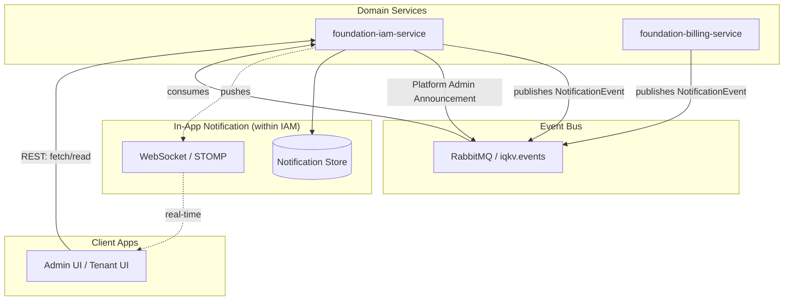

# Proposal: In-App Notification Center (Real-time & Multi-lingual)

## Overview

This document proposes the design for an integrated In-App Notification Center for the IQKV platform. The goal is to provide users with real-time updates and a persistent history of system events and multi-lingual announcements directly within the Admin and Tenant UIs.

The notification logic will be integrated into the `foundation-iam-service`, leveraging existing messaging infrastructure while adding persistence, real-time delivery via WebSockets, and robust internationalization (i18n) support.

## Goals

- **Notification Bell**: A consistent UI element in the top-right corner of Admin and Tenant UIs.
- **Persistent Storage**: Notifications stored in a `user_notifications` table within the IAM database.
- **Real-time Delivery**: Instant updates via WebSockets (STOMP) proxied through the API Gateway.
- **Internationalization (i18n)**:
  - User-specific `locale` property (defaulting to `en`).
  - System events translated via `MessageSource` during persistence.
  - Multi-lingual site-wide announcements with fallback logic.
- **Platform Admin Announcements**: Custom endpoints for admins to draft and broadcast messages in multiple languages.

## Proposed Architecture

### 1. Components & Extensions

- **`foundation-iam-service`**: Extended to handle:
  - User `locale` management.
  - Persistent storage for notifications.
  - WebSocket broker (STOMP).
  - Multi-lingual announcement drafts and fan-out logic.
- **`foundation-gateway-service`**: Configured to proxy WebSocket traffic to IAM.
- **`foundation-notification-model`**: Shared DTOs and events enriched with `targetUserId` and `locale`.

### 2. High-Level Design



### 3. Data Model & i18n

#### User Locale

The `users` table will be extended with a `locale` column (VARCHAR(20), default 'en-US'). This column stores BCP 47 language tags (e.g., `en-US`, `ru-RU`), ensuring full compatibility with Spring's `java.util.Locale`.

#### Global Locales Management

To ensure consistency across the platform and dynamic UI generation, a dedicated table for supported locales will be introduced in IAM.

```sql
CREATE TABLE locales (
    code VARCHAR(20) PRIMARY KEY, -- BCP 47 language tag (e.g., 'en-US', 'ru-RU', 'it-IT')
    name VARCHAR(50) NOT NULL,    -- e.g., 'English (US)'
    native_name VARCHAR(50),      -- e.g., 'English (US)'
    is_active BOOLEAN DEFAULT TRUE,
    is_default BOOLEAN DEFAULT FALSE,
    created_at TIMESTAMP WITH TIME ZONE DEFAULT CURRENT_TIMESTAMP
);
```

- **API**: `GET /api/v1/iam/locales` returns the list of active locales.
- **UI Impact**: The Announcement creation form and User Profile language switcher will dynamically fetch this list.

#### Notification Persistence

The `user_notifications` table stores the final, localized message for each user.

```sql
CREATE TABLE user_notifications (
    id UUID PRIMARY KEY,
    target_user_id UUID NOT NULL,
    locale VARCHAR(20) NOT NULL,  -- Captured at the time of creation (e.g., 'en-US')
    type VARCHAR(50) NOT NULL,
    severity VARCHAR(20),
    title VARCHAR(255) NOT NULL,  -- Localized title
    message TEXT,                 -- Localized message
    payload JSONB,                -- Metadata for Deep Linking
    is_read BOOLEAN DEFAULT FALSE,
    created_at TIMESTAMP WITH TIME ZONE DEFAULT CURRENT_TIMESTAMP,
    read_at TIMESTAMP WITH TIME ZONE
);
```

#### Site-wide Announcements

A dedicated table for managing multi-lingual site-wide announcements before broadcasting.

**Note on Immutability**: Once an announcement is successfully published (status `PUBLISHED`), it becomes read-only. Any modifications must be handled by creating a new announcement.

**Translation Logic**:

- **English (`en-US`) is mandatory**: It serves as the global fallback. The UI must enforce that `en-US` title and message are provided.
- **Other Locales are optional**: If a translation field (title or message) for a non-English locale is left empty in the UI, that specific translation record will not be created in the database.
- **Fallback Mechanism**: During the fan-out process, if a translation for the user's preferred locale is missing, the system will automatically use the `en-US` version.

```sql
CREATE TABLE site_announcement (
    id UUID PRIMARY KEY,
    type VARCHAR(50),
    status VARCHAR(20) DEFAULT 'DRAFT', -- DRAFT, PENDING, PUBLISHING, PUBLISHED
    created_at TIMESTAMP WITH TIME ZONE DEFAULT CURRENT_TIMESTAMP
);

CREATE TABLE site_announcement_translations (
    announcement_id UUID REFERENCES site_announcement(id),
    locale VARCHAR(20) NOT NULL, -- BCP 47 tag
    title VARCHAR(255) NOT NULL,
    message TEXT NOT NULL,
    PRIMARY KEY (announcement_id, locale)
);
```

### 4. Payload Structure (JSONB)

The `payload` field allows for flexible metadata used by the UI for **Deep Linking** and rendering hints.

- **Entity References**: `{"invoiceId": "INV-123"}`
- **Navigation**: `{"targetRoute": "/billing/invoices/INV-123"}`
- **UI Hints**: `{"icon": "IconReceipt", "color": "blue"}`

### 5. Integration Flows

#### System Events i18n

1. A service publishes a `NotificationEvent` (e.g., `PASSWORD_CHANGED`).
2. IAM `NotificationConsumer` receives the event.
3. IAM fetches the `targetUserId`'s `locale`.
4. The service uses `MessageSource` with the resolved `locale` to translate the event key into a final string.
5. The localized notification is saved to `user_notifications`.

### 6. Background Processing (Fan-out Strategy)

Site-wide announcements will be managed via the `foundation-iam-service`. To ensure stability when broadcasting to a large number of users, the fan-out process will follow a robust background processing pattern.

#### Processing Steps:

1. **Admin Input**: Platform Admin uses the Admin UI to create an announcement. The UI provides a group of text areas based on supported languages (e.g., `en-US`, `ru-RU`, `it-IT`).
2. **Drafting**: Draft is saved to `site_announcement` and `site_announcement_translations`.
3. **Fan-out Trigger**: Admin triggers "Publish", which updates the status to `PENDING` and sends an internal `AnnouncementPublishEvent` to RabbitMQ.
4. **Chunked Processing (Background)**:
   - An async consumer receives the event and transitions the announcement to `PUBLISHING`.
   - **Streaming**: The system fetches users using **MyBatis `Cursor`**. This allows processing millions of users without loading them all into memory, maintaining a constant memory footprint.
   - **Chunking**: Users are processed in chunks (e.g., 1,000 users per batch).
   - **Batch Insert**: For each chunk, the system performs a `Batch Insert` into `user_notifications` with the localized content (mapped based on each user's `locale`, falling back to `en-US` if the specific translation is missing).
5. **Completion**: Once the cursor is fully consumed, the announcement is marked as `PUBLISHED`. From this point forward, the announcement and its translations are immutable.
6. **Real-time Push**: As each chunk is persisted, the system triggers WebSocket pushes to active users in that specific chunk.

### 7. Real-time Delivery (WebSockets & Gateway)

The `foundation-gateway-service` acts as the entry point and must proxy WebSocket traffic.

#### Gateway Route

```yaml
spring:
  cloud:
    gateway:
      routes:
        - id: iam-websocket
          uri: ${IAM_SERVICE_WS_URI:ws://localhost:8080}
          predicates:
            - Path=/api/v1/iam/ws/**
```

#### Handshake & Topics

- **Security**: JWT passed in the `Authorization` header during handshake.
- **Topics**:
  - `/user/queue/notifications`: Personal notifications.
  - `/topic/announcements`: Global broadcasts.

### 8. UI Implementation (FSD)

- **`features/notification-bell`**:
  - `ui/`: Bell icon with unread count, dropdown list.
  - `model/`: Zustand store for state management and WebSocket lifecycle.
  - `api/`: TanStack Query hooks for history and "mark as read".
- **Admin Announcement UI**: Multi-tab or multi-textarea form for entering content in different locales (dynamically fetched BCP 47 tags).

### 9. Roadmap

1. **Phase 1**: Extend `users` table with `locale` (VARCHAR(20)), update `NotificationEvent` with `targetUserId`, and implement the `locales` management table using BCP 47 tags.
2. **Phase 2**: Implement `user_notifications` storage and localized `MessageSource` processing in IAM, along with the `GET /api/v1/iam/locales` API.
3. **Phase 3**: Configure Gateway for WebSocket routing.
4. **Phase 4**: Implement WebSocket (STOMP) in IAM and `NotificationBell` in UI.
5. **Phase 5**: Implement multi-lingual Announcement drafting and fan-out logic with chunked background processing and BCP 47 fallback.
