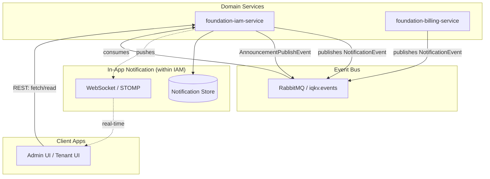

# Proposal: In-App Notification Center (Real-time & Multi-lingual)

## Overview

This document proposes the design for an integrated In-App Notification Center for the IQKV platform. The goal is to provide users with real-time updates and a persistent history of system events and multi-lingual announcements directly within the Admin and Tenant UIs.

The notification logic will be integrated into the `foundation-iam-service`, leveraging existing messaging infrastructure while adding persistence, real-time delivery via WebSockets, and robust internationalization (i18n) support.

## Goals

- **Notification Bell**: A consistent UI element in the top-right corner of Admin and Tenant UIs.
- **Persistent Storage**: Notifications stored in a `user_notifications` table within the IAM database.
- **Real-time Delivery**: Instant updates via WebSockets (STOMP) proxied through the API Gateway.
- **Internationalization (i18n)**:
  - User-specific `locale` property stored as a BCP 47 tag (e.g. `en-US`).
  - System events translated via `MessageSource` at persistence time.
  - Multi-lingual site-wide announcements with `en-US` mandatory fallback.
- **Platform Admin Announcements**: Custom endpoints for admins to draft and broadcast messages in multiple languages.

## Proposed Architecture

### 1. Components & Extensions

- **`foundation-iam-service`**: Extended to handle:
  - User `locale` management.
  - Persistent storage for notifications.
  - WebSocket broker (STOMP).
  - Multi-lingual announcement drafts and fan-out logic.
- **`foundation-gateway-service`**: Proxies WebSocket traffic to IAM via the existing `iam-api` catch-all route (`/api/v1/iam/**`). No dedicated WebSocket route is required.
- **`foundation-notification-model`**: Shared DTOs and events enriched with `targetUserId` and `locale`.

### 2. High-Level Design



### 3. Data Model & i18n

#### User Locale

The `users` table will be extended with a `locale` column (`VARCHAR(20)`, default `en-US`). This column stores BCP 47 language tags (e.g., `en-US`, `ru-RU`), ensuring full compatibility with Spring's `java.util.Locale`.

#### Global Locales Management

To ensure consistency across the platform and dynamic UI generation, a dedicated table for supported locales will be introduced in IAM.

```sql
CREATE TABLE locales (
    code        VARCHAR(20) PRIMARY KEY,          -- BCP 47 tag (e.g. 'en-US', 'ru-RU', 'it-IT')
    name        VARCHAR(50) NOT NULL,             -- Display name (e.g. 'English (US)')
    native_name VARCHAR(50),                      -- Native script name (e.g. 'Русский', 'Italiano')
    is_active   BOOLEAN DEFAULT TRUE,
    is_default  BOOLEAN DEFAULT FALSE,
    created_at  TIMESTAMP WITH TIME ZONE DEFAULT CURRENT_TIMESTAMP
);
```

- **API**: `GET /api/v1/iam/locales` — public, returns all active locales ordered by default first, then name.
- **UI Impact**: The Announcement creation form and User Profile language switcher will dynamically fetch this list.

#### Notification Persistence

The `user_notifications` table stores the final, already-localized message for each user. Locale is captured at creation time so the record is self-contained regardless of future user preference changes.

```sql
CREATE TABLE user_notifications (
    id             UUID PRIMARY KEY,
    target_user_id UUID NOT NULL,
    locale         VARCHAR(20) NOT NULL,   -- BCP 47 tag captured at creation time
    type           VARCHAR(50) NOT NULL,
    severity       VARCHAR(20),
    title          VARCHAR(255) NOT NULL,  -- Localized title
    message        TEXT,                  -- Localized message
    payload        JSONB,                 -- Deep-linking metadata
    is_read        BOOLEAN DEFAULT FALSE,
    created_at     TIMESTAMP WITH TIME ZONE DEFAULT CURRENT_TIMESTAMP,
    read_at        TIMESTAMP WITH TIME ZONE
);
```

#### Site-wide Announcements

A dedicated table for managing multi-lingual site-wide announcements before broadcasting.

**Note on Immutability**: Once an announcement moves past `DRAFT` status it becomes read-only. Specifically, `PENDING`, `PUBLISHING`, and `PUBLISHED` announcements reject updates and deletes. Any modifications must be handled by creating a new announcement. `FAILED` announcements are also immutable — a new announcement must be created to retry.

**Translation Logic**:

- **English (`en-US`) is mandatory**: It serves as the global fallback. The API rejects requests without an `en-US` translation.
- **Other Locales are optional**: If a translation field (title or message) for a non-English locale is left empty in the UI, that specific translation record will not be created in the database.
- **Fallback Mechanism**: During the fan-out process, if a translation for the user's preferred locale is missing, the system will automatically use the `en-US` version.

```sql
CREATE TABLE site_announcement (
    id         UUID PRIMARY KEY,
    type       VARCHAR(50),
    status     VARCHAR(20) DEFAULT 'DRAFT',
    -- Status lifecycle: DRAFT → PENDING → PUBLISHING → PUBLISHED
    --                                               ↘ FAILED
    created_at TIMESTAMP WITH TIME ZONE DEFAULT CURRENT_TIMESTAMP
);

CREATE TABLE site_announcement_translations (
    announcement_id UUID REFERENCES site_announcement(id),
    locale          VARCHAR(20) NOT NULL,  -- BCP 47 tag
    title           VARCHAR(255) NOT NULL,
    message         TEXT NOT NULL,
    PRIMARY KEY (announcement_id, locale)
);
```

**Announcement status lifecycle**:

```
DRAFT ──publish()──► PENDING ──consumer──► PUBLISHING ──success──► PUBLISHED
                                                       └──failure──► FAILED
```

- `DRAFT`: Editable. Translations can be added, updated, or removed.
- `PENDING`: Queued for fan-out. Immutable.
- `PUBLISHING`: Fan-out in progress. Immutable.
- `PUBLISHED`: Fan-out complete. Immutable. Visible to users.
- `FAILED`: Fan-out failed. Immutable. Requires creating a new announcement to retry.

### 4. Payload Structure (JSONB)

The `payload` field allows for flexible metadata used by the UI for **Deep Linking** and rendering hints.

- **Entity References**: `{"invoiceId": "INV-123"}`
- **Navigation**: `{"targetRoute": "/billing/invoices/INV-123"}`
- **UI Hints**: `{"icon": "IconReceipt", "color": "blue"}`

### 5. Integration Flows

#### System Event Flow (Email + In-App)

Handles automated events from domain services (e.g. `PASSWORD_CHANGED`, `INVOICE_PAID`).

1. A domain service publishes a `NotificationEvent` to the `iqkv.events` exchange with routing key `notification.iam.email`.
2. `NotificationConsumer` receives the event from the `iqkv.iam.notifications` queue.
3. `EmailService` sends a localized email to the recipient.
4. **Locale resolution** (in priority order):
   - `locale` field on the `NotificationEvent` if present.
   - User's `locale` from the `users` table, looked up by `targetUserId` or `recipientEmail`.
   - System default `en-US` as final fallback.
5. `MessageSource` translates the event type into a localized title and message using keys:
   - `notification.{TYPE}.title`
   - `notification.{TYPE}.message`
6. The localized `UserNotification` is persisted to `user_notifications`.
7. A WebSocket message is pushed to the user's personal destination: `/user/queue/notifications`.

Errors are caught and logged without re-throwing — failed messages route to the DLQ (`iqkv.dlq`) via the dead-letter exchange.

### 6. Background Processing (Fan-out Strategy)

Site-wide announcements will be managed via the `foundation-iam-service`. To ensure stability when broadcasting to a large number of users, the fan-out process will follow a robust background processing pattern.

#### Processing Steps:

1. **Admin Input**: Platform Admin uses the Admin UI to create an announcement via `POST /api/v1/iam/admin/announcements`. The UI provides text areas per supported locale (dynamically fetched BCP 47 tags). `en-US` is required.
2. **Drafting**: Draft is saved to `site_announcement` and `site_announcement_translations`.
3. **Fan-out Trigger**: Admin calls `POST /api/v1/iam/admin/announcements/{id}/publish`. The service validates the announcement is in `DRAFT` status, transitions it to `PENDING`, and publishes an `AnnouncementPublishEvent` to RabbitMQ with routing key `announcement.publish`.
4. **Guard check**: `AnnouncementConsumer` receives the event and verifies the announcement is still `PENDING`. If not (e.g. redelivery after a prior attempt), the message is silently discarded.
5. **Chunked Processing (Background)**:
   - Status is transitioned to `PUBLISHING` via `REQUIRES_NEW` propagation, committing independently of the listener transaction.
   - **Streaming**: The system fetches active users using **MyBatis `Cursor`** with `fetchSize=1000`. This streams users from PostgreSQL without loading them all into memory, maintaining a constant memory footprint.
   - **Chunking**: Users are processed in batches of 1,000. For each user, the appropriate translation is selected by matching `user.locale` against the announcement's translation map, falling back to `en-US`. Each batch is persisted via `REQUIRES_NEW`, so each batch commit is independent — a mid-fan-out crash does not roll back already-persisted batches.
6. **Completion**: After the cursor is fully consumed, a single `AnnouncementBroadcastResponse` is pushed to `/topic/announcements` via WebSocket, then the announcement status is set to `PUBLISHED`.
7. **Failure handling**: Any exception during streaming/batching sets the status to `FAILED` and re-throws, routing the message to the DLQ. The `PENDING` guard in step 4 prevents redelivery from re-running the fan-out.

#### Notification Lifecycle (REST API)

| Operation                       | Endpoint                                                             | Auth          |
| ------------------------------- | -------------------------------------------------------------------- | ------------- |
| Fetch notifications (paginated) | `GET /api/v1/iam/users/notifications?limit=10&offset=0&isRead=false` | Authenticated |
| Mark one as read                | `PUT /api/v1/iam/users/notifications/{id}/read`                      | Authenticated |
| Mark all as read                | `PUT /api/v1/iam/users/notifications/read-all`                       | Authenticated |
| Fetch active announcements      | `GET /api/v1/iam/announcements?locale=en-US`                         | Public        |

The `GET /api/v1/iam/users/notifications` response includes `totalElements`, `unreadCount`, and a paginated `items` list. The `isRead` query parameter is optional — omitting it returns all notifications.

The `GET /api/v1/iam/announcements` endpoint returns only `PUBLISHED` announcements for the requested locale. It is public and unauthenticated, intended for the notification bell's initial load.

### 7. Real-time Delivery (WebSockets & Gateway)

The `foundation-gateway-service` proxies WebSocket traffic via the existing `iam-api` catch-all route (`/api/v1/iam/**`). No dedicated WebSocket route is needed — the SockJS handshake and HTTP upgrade are handled transparently.

#### Configuration

`WebSocketConfig` registers a STOMP endpoint at `/api/v1/iam/ws` with SockJS fallback. The in-memory broker handles `/topic` (broadcast) and `/queue` (user-scoped) destinations.

```java
config.enableSimpleBroker("/topic", "/queue");
config.setApplicationDestinationPrefixes("/app");
config.setUserDestinationPrefix("/user");
```

#### Topics

| Destination                 | Payload                         | Use case                                    |
| --------------------------- | ------------------------------- | ------------------------------------------- |
| `/user/queue/notifications` | `UserNotificationResponse`      | Personal system event notifications         |
| `/topic/announcements`      | `AnnouncementBroadcastResponse` | Site-wide broadcast after fan-out completes |

The `AnnouncementBroadcastResponse` is a dedicated DTO (carrying `announcementId`, `type`, `severity`, `title`, `message`, and `createdAt`) — not a `UserNotification` — so the UI can distinguish broadcast signals from personal notifications.

#### Security Note

The STOMP endpoint uses SockJS. JWT authentication during the WebSocket handshake should be passed in the STOMP `CONNECT` frame headers, not the HTTP `Authorization` header (which SockJS does not reliably forward).

### 8. Admin API

All admin endpoints require `PLATFORM_ADMIN` authority.

| Method   | Endpoint                                       | Description                                   |
| -------- | ---------------------------------------------- | --------------------------------------------- |
| `POST`   | `/api/v1/iam/admin/announcements`              | Create a draft announcement with translations |
| `GET`    | `/api/v1/iam/admin/announcements`              | List all announcements (paginated)            |
| `GET`    | `/api/v1/iam/admin/announcements/{id}`         | Get announcement by ID                        |
| `PUT`    | `/api/v1/iam/admin/announcements/{id}`         | Update a `DRAFT` or `FAILED` announcement     |
| `DELETE` | `/api/v1/iam/admin/announcements/{id}`         | Delete a `DRAFT` or `FAILED` announcement     |
| `POST`   | `/api/v1/iam/admin/announcements/{id}/publish` | Trigger fan-out (returns `202 Accepted`)      |

### 9. UI Implementation (FSD)

- **`features/notification-bell`**:
  - `ui/`: Bell icon with unread count badge, dropdown list of recent notifications.
  - `model/`: Zustand store for notification state and WebSocket lifecycle management.
  - `api/`: TanStack Query hooks for history fetch and mark-as-read mutations.
- **Admin Announcement UI**: Multi-locale form with text areas per supported language. Locale list is fetched dynamically from `GET /api/v1/iam/locales`. `en-US` fields are required; all others are optional.

**Polling vs Push**: The UI uses TanStack Query for polling and cache management. WebSocket pushes trigger cache invalidation for immediate updates without replacing the polling strategy.

### 10. Roadmap

1. **Phase 1**: Extend `users` table with `locale` (BCP 47 `VARCHAR(20)`), update `NotificationEvent` with `targetUserId`, and implement the `locales` management table with `GET /api/v1/iam/locales`.
2. **Phase 2**: Implement `user_notifications` storage, localized `MessageSource` processing in IAM, and the full system event flow (email + in-app + WebSocket push).
3. **Phase 3**: Configure Gateway WebSocket proxying via the existing `iam-api` catch-all route.
4. **Phase 4**: Implement WebSocket (STOMP) broker in IAM and `NotificationBell` in UI.
5. **Phase 5**: Implement multi-lingual Announcement CRUD + publish API, streaming fan-out with chunked batch insert, `FAILED` status handling, and `AnnouncementBroadcastResponse` WebSocket DTO.
